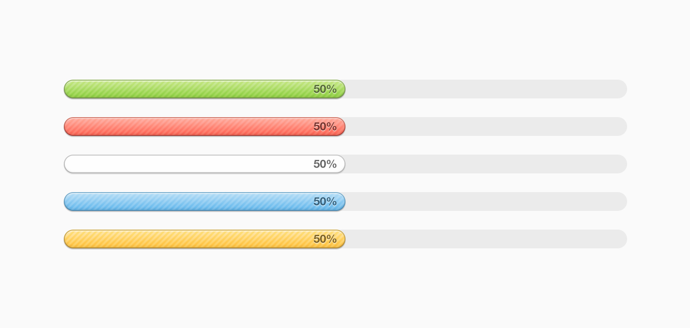

# HTML_CSS_Progress_Bar_Test

This test assess your `HTML` and `CSS` skills.

### Your Task

Using only `HTML` and `CSS`, build the following multi-colored progress bars:

Also, add a button named "Finish" which will complete all progress bars to "100%" using basic `JavaScript` functionality.

### Requirements
1. Should be as close as possible to the provided design.
2. Should have a "Finish" button to complete the progress for all bars to 100%.
3. Your solution should consist of clean and readable code.

This test should take no longer than 1 hour to complete successfully.

Good luck!
